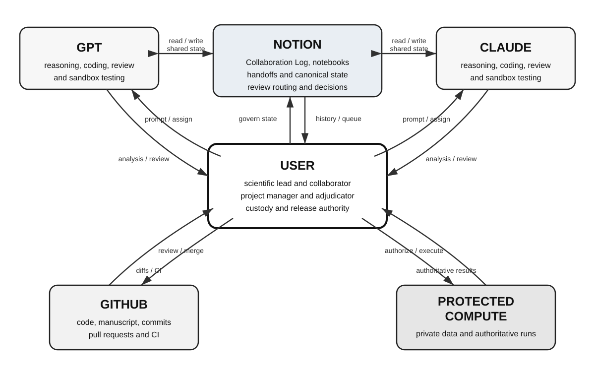

# Architecture

The workflow separates three things that chat interfaces combine: communication, artifacts, and authority.

| Function | Location | Authority |
| --- | --- | --- |
| Communication and coordination | Notion Collaboration Log, notebooks, canonical-state pages | Either platform may propose; the User accepts |
| Versioned artifacts | GitHub: code, manuscript source, commits, CI | Either platform may propose; the User alone merges |
| Authoritative execution | Protected compute holding private data | The User alone authorizes and runs |

{#fig:workflow width=100%}

Neither assistant has access to protected compute. Both read and write the shared record. Repository access is optional and varies by platform and session: it may be public read-only access, or a repository-scoped integration authenticated as the User.

The Collaboration Log is a structured database rather than a transcript. Each record carries a type, a lifecycle status, an owner, provenance tags, review routing to a named participant, and a next action. Handoffs are explicit records that anchor state so a fresh session can resume without the User restating context. In practice the User's transition prompt is often minimal, sometimes only "Check the log," because the record carries what the next session needs.

## Evidence hierarchy

Not all statements in the record have equal standing, and the schema is designed to keep them distinct.

Model statements are proposals. Sandbox runs are environment-specific evidence: they demonstrate that something worked in one environment, not that it will work in the protected one. Protected runs, executed by the User, are authoritative. Commits establish artifact custody, not correctness. A proposal becomes accepted state only when the User judges that the recorded evidence satisfies a stated gate.

This distinction is what prevents fluent agreement from substituting for verification. Both assistants are capable of producing confident, well-formed, wrong statements, and both did so during this work.
