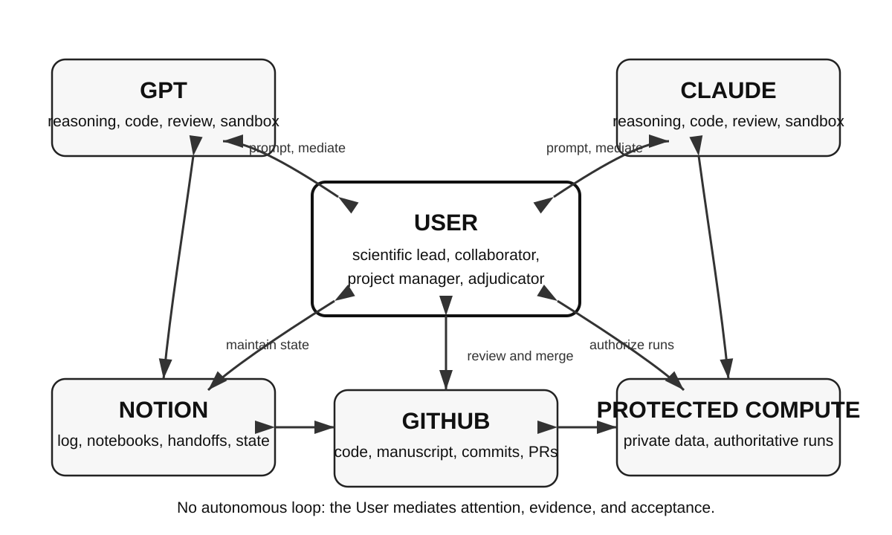

---
title: 'Beyond the Chat Window: User-Mediated Collaboration Across AI Platforms'
keywords:
- artificial intelligence
- multi-agent collaboration
- user-mediated collaboration
- human-governed research
- scientific workflow
- FAIR
- Manubot
- reproducibility
lang: en-US
date-meta: '2026-08-14'
author-meta:
- Deanne M. Taylor
header-includes: |
  <!--
  Manubot generated metadata rendered from header-includes-template.html.
  Suggest improvements at https://github.com/manubot/manubot/blob/main/manubot/process/header-includes-template.html
  -->
  <meta name="dc.format" content="text/html" />
  <meta property="og:type" content="article" />
  <meta name="dc.title" content="Beyond the Chat Window: User-Mediated Collaboration Across AI Platforms" />
  <meta name="citation_title" content="Beyond the Chat Window: User-Mediated Collaboration Across AI Platforms" />
  <meta property="og:title" content="Beyond the Chat Window: User-Mediated Collaboration Across AI Platforms" />
  <meta property="twitter:title" content="Beyond the Chat Window: User-Mediated Collaboration Across AI Platforms" />
  <meta name="dc.date" content="2026-08-14" />
  <meta name="citation_publication_date" content="2026-08-14" />
  <meta property="article:published_time" content="2026-08-14" />
  <meta name="dc.modified" content="2026-08-14T10:11:32+00:00" />
  <meta property="article:modified_time" content="2026-08-14T10:11:32+00:00" />
  <meta name="dc.language" content="en-US" />
  <meta name="citation_language" content="en-US" />
  <meta name="dc.relation.ispartof" content="Manubot" />
  <meta name="dc.publisher" content="Manubot" />
  <meta name="citation_journal_title" content="Manubot" />
  <meta name="citation_technical_report_institution" content="Manubot" />
  <meta name="citation_author" content="Deanne M. Taylor" />
  <meta name="citation_author_institution" content="Department of Biomedical and Health Informatics, Children&#39;s Hospital of Philadelphia, Philadelphia, Pennsylvania, USA" />
  <meta name="citation_author_institution" content="Department of Pediatrics, Perelman School of Medicine, University of Pennsylvania, Philadelphia, Pennsylvania, USA" />
  <link rel="canonical" href="https://TaylorResearchLab.github.io/beyond-the-chat-window/" />
  <meta property="og:url" content="https://TaylorResearchLab.github.io/beyond-the-chat-window/" />
  <meta property="twitter:url" content="https://TaylorResearchLab.github.io/beyond-the-chat-window/" />
  <meta name="citation_fulltext_html_url" content="https://TaylorResearchLab.github.io/beyond-the-chat-window/" />
  <meta name="citation_pdf_url" content="https://TaylorResearchLab.github.io/beyond-the-chat-window/manuscript.pdf" />
  <link rel="alternate" type="application/pdf" href="https://TaylorResearchLab.github.io/beyond-the-chat-window/manuscript.pdf" />
  <link rel="alternate" type="text/html" href="https://TaylorResearchLab.github.io/beyond-the-chat-window/v/68b45c07aeef132947abf88284c408f7df94f02a/" />
  <meta name="manubot_html_url_versioned" content="https://TaylorResearchLab.github.io/beyond-the-chat-window/v/68b45c07aeef132947abf88284c408f7df94f02a/" />
  <meta name="manubot_pdf_url_versioned" content="https://TaylorResearchLab.github.io/beyond-the-chat-window/v/68b45c07aeef132947abf88284c408f7df94f02a/manuscript.pdf" />
  <meta property="og:type" content="article" />
  <meta property="twitter:card" content="summary_large_image" />
  <link rel="icon" type="image/png" sizes="192x192" href="https://manubot.org/favicon-192x192.png" />
  <link rel="mask-icon" href="https://manubot.org/safari-pinned-tab.svg" color="#ad1457" />
  <meta name="theme-color" content="#ad1457" />
  <!-- end Manubot generated metadata -->
bibliography:
- content/manual-references.json
manubot-output-bibliography: output/references.json
manubot-output-citekeys: output/citations.tsv
manubot-requests-cache-path: ci/cache/requests-cache
manubot-clear-requests-cache: false
...

<small><em>
This manuscript was automatically generated by Manubot on August 14, 2026 from the public repository [TaylorResearchLab/beyond-the-chat-window](https://github.com/TaylorResearchLab/beyond-the-chat-window).
</em></small>

## Authors

+ **Deanne M. Taylor**
   
  <small>
     Department of Biomedical and Health Informatics, Children's Hospital of Philadelphia, Philadelphia, Pennsylvania, USA; Department of Pediatrics, Perelman School of Medicine, University of Pennsylvania, Philadelphia, Pennsylvania, USA
  </small>

::: {#correspondence}
Correspondence is available through [GitHub Issues](https://github.com/TaylorResearchLab/beyond-the-chat-window/issues).
:::

# Abstract

We conducted a retrospective, single-user descriptive study of a human-governed, User-mediated workflow for collaboration across two commercial large language model platforms. GPT and Claude were coordinated through a structured Notion workspace linked to versioned GitHub artifacts and a Manubot manuscript repository. The human investigator, designated the User, controlled task assignment, acceptance, merge, and release. The frozen snapshot contained 728 records from seven standardized Collaboration Logs across six active workspaces. The record documented accepted contributions from both platforms in lead and review roles, recurrent cross-platform correction, and reversible role assignment. It also documented unlogged work, incomplete artifact custody, invalid checksums, unsupported assertions, and unnecessary process gating. The workflow created a persistent record of decisions, evidence, artifacts, and handoffs that isolated chat sessions did not provide. Principal limitations were dependence on active human curation, mutable review fields, nontransactional connector behavior, and incomplete action attribution in platform metadata. This manuscript was produced with the same workflow. The study does not estimate comparative model performance or establish superiority over alternative collaboration methods.

# Introduction

Scientific projects often span multiple sessions, repositories, controlled computing environments, and model providers. Isolated chat interfaces do not reliably preserve project state, decision provenance, or artifact identity across these boundaries. Existing multi-agent frameworks generally automate model-to-model communication within a shared orchestration layer [@arxiv:2308.08155; @arxiv:2308.00352; @arxiv:2307.07924].

This study documents a contrasting configuration in which GPT and Claude did not communicate directly. A human investigator, designated the User, mediated all cross-platform transitions through a structured record and retained authority over scope, controlled execution, acceptance, merge, and release.

The objectives were to describe the workflow architecture, define its governance and evidence rules, characterize the frozen retrospective corpus, and report observed collaboration patterns and operational failures. FAIR principles informed the record design [@doi:10.1038/sdata.2016.18]. The study is descriptive and does not test causal benefit or compare platform performance.

# Related work

Blackboard architectures provide the closest systems precedent for this workflow. Hearsay-II established a shared workspace to which independent knowledge sources contributed under a control process [@doi:10.1145/356810.356816], and Nii later generalized the architecture as a problem-solving framework [@doi:10.1609/aimag.v7i2.537]. The present workflow implements the same functional decomposition: Notion stores shared state, GPT and Claude act as knowledge sources, and the User selects the next action and determines whether a contribution enters accepted state.

The contribution lies in the implementation context rather than in the topology. The knowledge sources are separate commercial services with no shared memory, context, message channel, or execution environment. Human governance replaces an automated scheduler, and a commercial productivity database replaces an in-process data structure.

Contemporary multi-agent frameworks generally automate coordination within a single provider or orchestration layer [@arxiv:2308.08155; @arxiv:2308.00352; @arxiv:2307.07924]. Recent systems extend this approach toward semi-autonomous scientific discovery [@arxiv:2505.13400] and domain-specific scientific data workflows [@arxiv:2503.05854]. The workflow evaluated here deliberately minimizes autonomy. Manubot provides the versioned manuscript and continuous-integration pipeline used in the reflexive case [@doi:10.1371/journal.pcbi.1007128].

# Methods

## Workflow architecture

We implemented a three-layer workflow that separated coordination, versioned artifacts, and authoritative execution.

| Function | Location | Authority |
| --- | --- | --- |
| Communication and coordination | Notion Collaboration Log, notebooks, canonical-state pages | Either platform could propose; the User accepted or rejected |
| Versioned artifacts | GitHub code, manuscript source, commits, and continuous integration | Either platform could propose; the User controlled merge |
| Authoritative execution | User-controlled computing environment containing private data | The User authorized and performed execution |

{#fig:workflow width=100%}

All cross-platform transitions were initiated by the User. Neither assistant had direct access to the authoritative computing environment. Both assistants could read and write the shared Notion record. Repository access varied by platform and session and included public read access or a repository-scoped integration authenticated as the User.

The Collaboration Log was implemented as a structured database rather than a transcript. Each record included a record type, lifecycle status, owner, provenance tags, named review routing, and a next action. Handoff records captured accepted state, current artifacts, unresolved questions, and the next task. A new session resumed by reading the handoff, linked records, and current commits. When the record was complete, the User could synchronize the next session with the instruction "Check the log."

## Evidence classification and acceptance

We classified model text as a proposal, sandbox output as environment-specific evidence, User-run output as authoritative evidence, and commits as evidence of artifact identity. A successful sandbox run did not establish performance in the authoritative environment, and a commit did not establish scientific correctness. The User accepted a contribution only after the recorded evidence satisfied the applicable gate.

## Governance and quality controls

The workflow used a work contract that specified participant roles, durable destinations for outputs, evidence requirements, required logging, handoff conditions, citation validation, and dispute resolution. RULE ONE required every scholarly reference to be validated against a primary publication record before merge. Two additional controls were added after observed failures. The output-custody rule required code, inputs, and results to be stored together or linked from the same record. The read-back rule required every created or moved record to be fetched again and checked for the intended parent and preserved properties.

A completed synthetic work contract, reusable compact template, example log record, and example state-anchoring handoff are provided in Supplementary Note S1.

## Study design and corpus

We conducted a retrospective, single-user case study of workspaces that used the same Collaboration Log pattern. The frozen snapshot was taken on August 13, 2026 at 21:34:27 UTC. It contained 728 records from seven standardized logs across six active workspaces. The snapshot fixed the analytical boundary but did not indicate that any included project was complete. Specialized logs with noncomparable schemas and the manuscript-development log were retained for qualitative description and excluded from the total.

The analysis reports aggregate collaboration functions rather than scientific domains or project-specific counts. The functions included code development and review, state management, literature retrieval and citation checking, structural coding and analysis review, figure regeneration, independent recomputation, and creative-project consistency tracking.

The study did not estimate routing rates, agreement prevalence, or comparative performance. Review flags were mutable, and retrospective session context could not be reconstructed. Project-specific scientific content is not reported in this paper.

# Results

## Collaboration patterns

The frozen record documented reversible roles, reciprocal correction, and continued dependence on User oversight.

**Reversible roles.** Both platforms led tasks and reviewed work produced by the other platform. Both produced accepted contributions in each role. Task assignment was not randomized, so the record does not support a comparative performance claim.

**Reciprocal correction.** Corrections and retractions occurred in both directions. Courteous wording coexisted with substantive critique and therefore did not establish agreement.

**Persistent state with human oversight.** Handoffs, accepted records, and artifact references allowed new sessions to resume without reconstructing the project from chat history. The User still maintained review queues, selected canonical state, and resolved open questions.

## Operational failure modes and controls

The workflow used explicit controls for eight observed failure classes.

| Failure mode | Control |
| --- | --- |
| Loss of state across sessions | Canonical-state pages and state-anchoring handoff records |
| Fluent but unverified assertion | Evidence classification; acceptance required recorded evidence rather than model confidence |
| Cross-platform agreement interpreted as corroboration | Agreement after prior exchange was classified as sequential rather than independent |
| Divergence between the record and an artifact | Commit SHA and artifact location were recorded in the same log entry |
| Material decisions left only in conversation | The work contract required each material output to be logged |
| Results stored without supporting materials | The work contract required code, inputs, and results to be stored together |
| Database changes accepted without verification | Each create or move was followed by read-back verification |
| Mutable fields changed before analysis | The corpus was frozen before measurement |

## Tooling constraints

Four implementation constraints affected the workflow.

**The observed connector behavior was not transactional, and a success response was not confirmation.** Creating a record without an explicit parent placed it outside the intended database. The record remained reachable by URL but was absent from target-database queries. Moving it into the database could remove its structured properties. These failures occurred twice during manuscript preparation.

**Review routing was stored as mutable state rather than as an append-only event.** Clearing a review flag after completing a review removed evidence that the review occurred. Retrospective analysis therefore undercounted completed review by an unknown amount.

**Action initiation was not recoverable from repository metadata alone.** A change made through a User-controlled connector and a manual User push received the same repository attribution. The Collaboration Log was required to distinguish the two paths, and its accuracy depended on logging discipline.

**The available analysis interface did not support a fully automated corpus export.** Cross-data-source aggregation required a higher subscription tier, and query results were returned into model context rather than directly to a file.

## Reflexive manuscript-production case

The manuscript was developed using the same workflow. The Collaboration Log recorded four relevant events: one extraction was not logged when it was completed; its first record omitted the generating code and query and contained an invalid checksum; one review sequence included three unverified assertions; and one merge was delayed after all defined gates had passed.

Reciprocal review or User intervention corrected each event. These observations demonstrate that fluent model output is not evidence of verification and that the persistent record does not maintain itself.

# Discussion

This workflow supported sustained cross-platform collaboration while preserving human authority over evidence, artifacts, and acceptance. Its contribution is a governance and traceability method rather than an autonomous multi-agent system.

## Limitations

This is a retrospective single-user case study with no control condition. There are no experimental arms, prospectively defined outcomes, or blinding. The study does not establish that the workflow outperforms an alternative; it documents how the workflow was used, what it produced, and where it failed.

Rejection is under-recorded. Across the corpus, records marked rejected are very rare, which reflects that unpromising proposals were abandoned in conversation rather than logged. Any rate computed from rejection status measures logging discipline rather than the phenomenon.

Agreement between the assistants after exposure to each other's output is not independent corroboration, and the record cannot establish independence retrospectively: the log stores artifacts and timestamps, not what was in a session's context. Timestamp ordering establishes that exposure was possible, not that it occurred.

The unit of replication is the User, not the record. A corpus of many records produced by one person coordinating two platforms remains a single case.

# Future evaluation

Prospective studies should compare matched tasks under single-platform and User-mediated multi-platform conditions. Exposure status, assignments, review events, and acceptance decisions should be recorded at the time of action. Review should be represented as an append-only event rather than a mutable flag. Outcomes should be defined before data collection and should include defect detection, reproducibility, time to an accepted artifact, substantive revision, and User review burden.

A multi-investigator design should also separate continuous project memory, adjudication authority, and access control across participants. A same-provider, multiple-session condition would test whether the observed benefits depend on provider diversity or on the shared-record architecture itself. All prospective designs must balance measurement completeness against the additional logging burden imposed on active scientific work.

# Conclusion

This single-user case demonstrates that a persistent shared record can support collaboration between separate AI platforms while preserving human control. The required components were explicit authority, persistent state, artifact custody, reciprocal review, evidence classification, and User-controlled acceptance. The workflow supported traceable coordination but did not make the research process autonomous.

# Acknowledgments

The author thanks the Manubot developers for providing an open collaborative manuscript workflow. GPT and Claude were used as analysis, coding, review, and writing tools under human supervision. They are not authors and had no authority over submission or publication.

# Author contributions

**Deanne M. Taylor:** Conceptualization, Methodology, Investigation, Project administration, Supervision, Validation, Writing - original draft, Writing - review and editing.

# AI-assistance disclosure

GPT and Claude contributed analyses, code review, manuscript drafting, and revision suggestions. All material was directed, reviewed, adjudicated, and accepted by the human author. The human author is responsible for the manuscript.

# Data and code availability

The public GitHub repository contains the manuscript source, build configuration, revision history, rendered outputs, citation-validation ledger, and Supplementary Note S1 with a completed synthetic work contract and reusable template. The private Collaboration Logs are not released. A sanitized Collaboration Log template with synthetic records is planned as a companion resource.

# References

